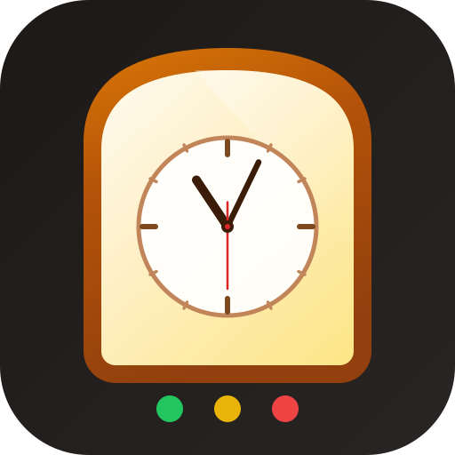

# ToastTime

A compact, always-on-top speech timer for club meetings and personal practice. Displays the classic traffic light system (Min / Warn / Max) with audible bell alerts.



---

## Download

Go to the [**Actions tab**](https://github.com/bjbyrne/toasttime/actions), open the latest successful build, and download the artifact for your platform:

| Platform | Artifact | File |
|----------|----------|------|
| Mac | `toasttime-mac-dmg` | `ToastTime-x.x.x.dmg` |
| Windows | `toasttime-windows-installer` | `ToastTime Setup x.x.x.exe` |

> **Note:** Releases are not yet code-signed. See the workaround below for your platform.

---

## Installation

### Mac
1. Download and open the `.dmg`
2. Drag **ToastTime** to your Applications folder
3. If Gatekeeper blocks the app, open Terminal and run:
   ```bash
   xattr -cr /Applications/ToastTime.app
   ```
4. Open ToastTime normally

### Windows
1. Download and run the `.exe` installer
2. If Windows Defender SmartScreen appears, click **More info → Run anyway**
3. ToastTime installs and launches automatically

---

## How to Use

### Setting Timings
- **Pick a role** from the dropdown to auto-fill standard club timings
- Or **scroll the Min / Warn / Max drums** to set custom times
- **Auto Warn** (checked by default) sets the Warn time automatically to the midpoint of Min and Max

### Running the Timer
1. Set your timings and select a role
2. Press **Start** when the speaker begins
3. Watch the traffic lights:
   - 🟢 **Min** — minimum time reached
   - 🟡 **Warn** — midpoint, time to wrap up
   - 🔴 **Max** — maximum time reached
   - 🔴 *Flashing* — overtime, past the grace period

### Options
| Option | Default | Description |
|--------|---------|-------------|
| +30s grace | On | Allows 30 seconds after Max before overtime flashes |
| Auto Warn | On | Sets Warn to the midpoint of Min and Max |

### Preset Roles

| Role | Min | Warn | Max |
|------|-----|------|-----|
| Impromptu Speech | 1:00 | 1:30 | 2:00 |
| Ice Breaker | 4:00 | 5:00 | 6:00 |
| Prepared Speech (5–7 min) | 5:00 | 6:00 | 7:00 |
| Prepared Speech (7–9 min) | 7:00 | 8:00 | 9:00 |
| Speech Evaluation | 2:00 | 2:30 | 3:00 |
| General Evaluator | 3:00 | 4:00 | 5:00 |
| Custom | — | — | — |

### Tips
- Drag the **title bar** to reposition the window alongside Zoom or WebEx
- Thresholds and options **lock while the timer is running**
- Hit **ⓘ** for a quick reference — the mini timer in the corner keeps running

---

## Building from Source

```bash
git clone https://github.com/bjbyrne/toasttime.git
cd toasttime
npm install
npm start          # dev mode with hot reload
npm run make       # build installer for your current platform
```

Requires Node 22+.

---

## Contact

Built by [Bruce Byrne](mailto:toasttime@bjbyrne.com) · toasttime@bjbyrne.com
